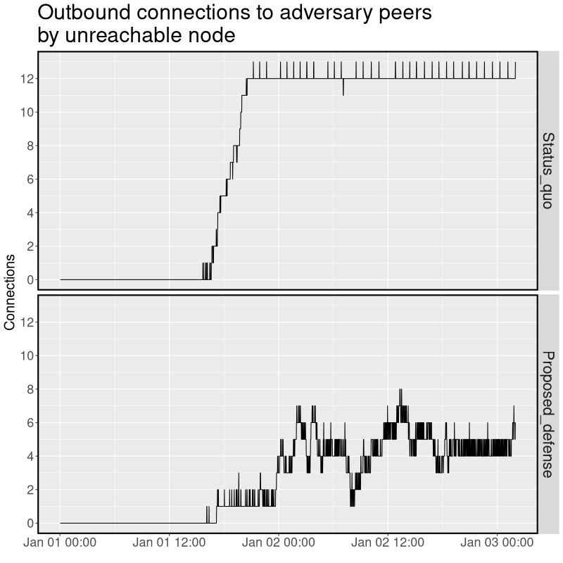
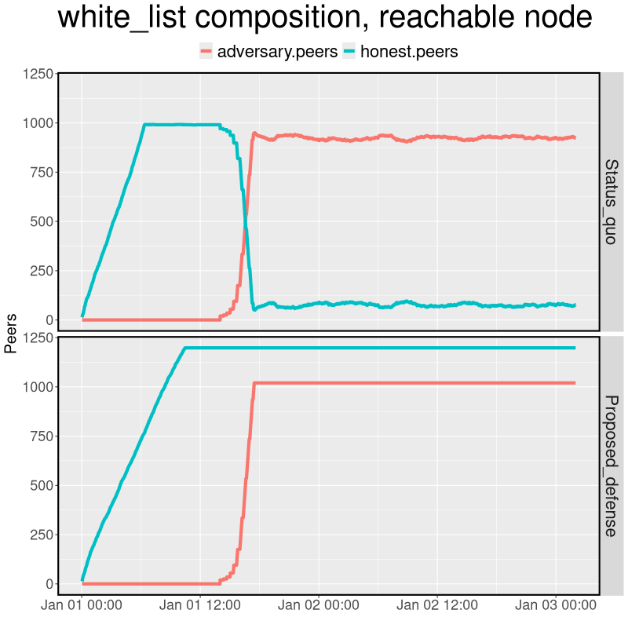
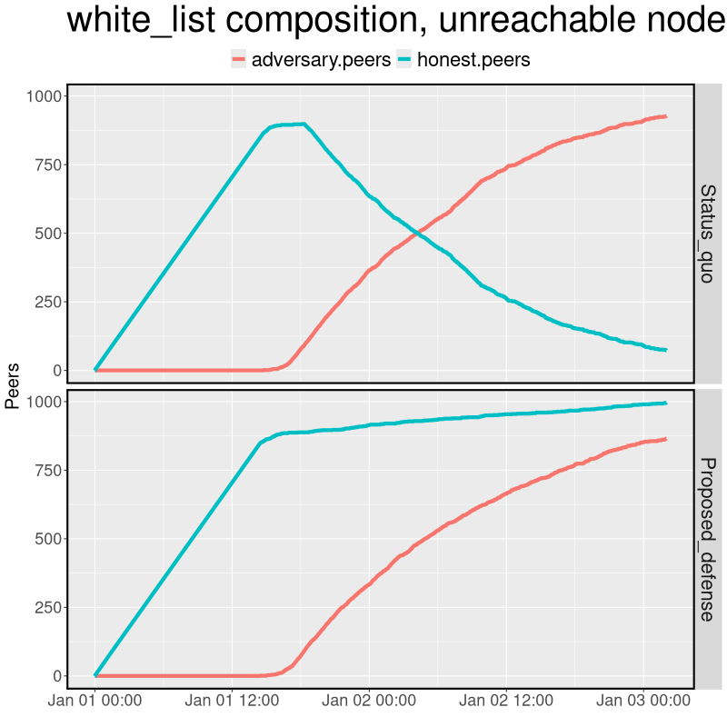
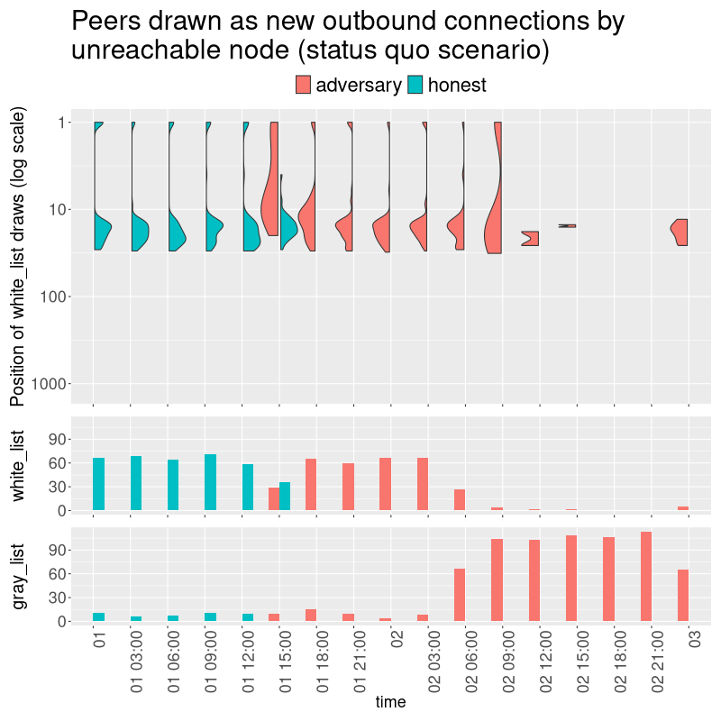
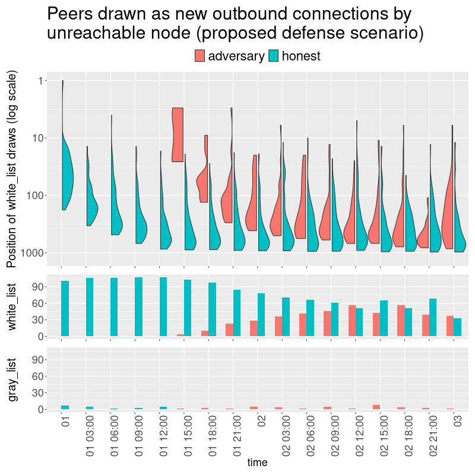
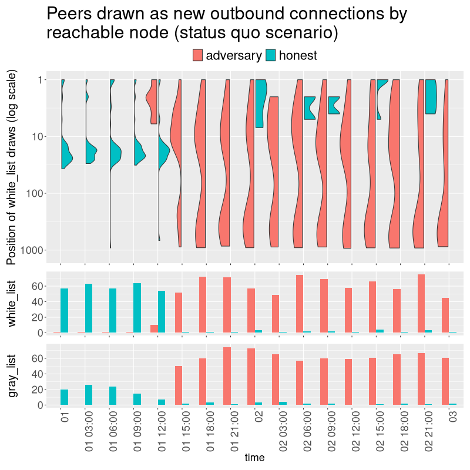
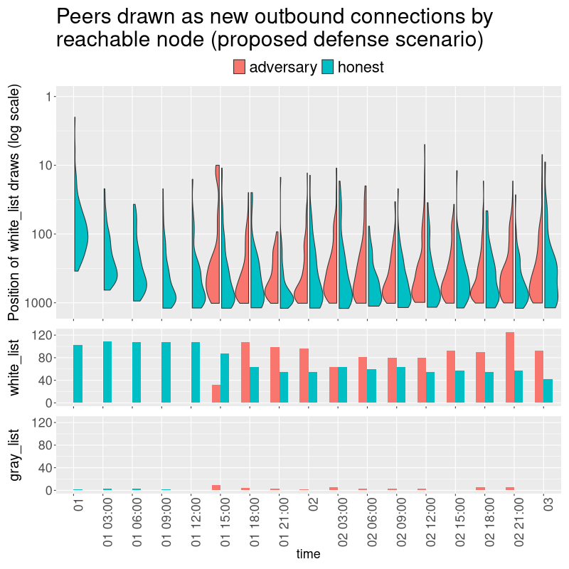

**TL;DR: An adversary with 1,000 or more IP addresses under its control can pack its IP addresses into honest nodes' peer lists and successfully execute an eclipse attack against nodes that do not have inbound connections. A simple three-component patch can defeat the attack.**

**AI/LLM usage statement:** An LLM was used to create the `monerosim` simulation that validated the effectiveness of the attack. An LLM was not used to develop the countermeasure patch, write the explanation below, nor to write the analysis code that visualizes the effects of the attack and the proposed patch.

## Introduction

This PR intends to defeat the Nyx Eclipse attack described in [Shi et al. (2026) "Are Unreachable Nodes Truly Safe? Fully Eclipsing Monero's P2P Network!"](https://arxiv.org/abs/2609.10260).

I won't go into every detail of how the node manages peer lists and connection selection. Shi et al. (2026) explains `monerod`'s mechanics in its Appendix B and its Nyx attack strategy in its Section 3.2. In particular, I won't describe the different ways that new peers can be inserted into the gray_list and how the Nyx attack exploits them. In summary, an adversary finds it easy to dominate honest nodes' gray_lists. Therefore, one of the reforms implemented by my patch reduces the role of the gray_list in connection selection.

## Definitions

**Outbound/inbound connections:** Connections that my node first initiated are considered outbound connections from my node's point of view. Connections that other nodes first initiated are considered inbound connections from my node's point of view. By default, a node establishes 12 outbound connections and accepts an unlimited number of inbound connections.

**Reachable/unreachable node:** A reachable node is a node that accepts inbound connections from other nodes. An unreachable node is a node that does not accept inbound connections from other nodes. The node may block inbound connections because of local firewall rules, being located behind a NAT, manually setting the node's number of inbound connections to zero, or some other reason. Many ordinary users who run a node from their own home would have an unreachable node unless they follow a procedure to open ports on their home router. It is likely that the majority of nodes on the network are unreachable.

**white_list:** A list maintained by a node that contains _reachable_ peers (IP:port tuples) that responded to a PING-PONG request at some point in the past. Each peer has a `last_seen` value associated with it, updated according to certain rules. The default maximum size of the white_list is 1,000. When the limit is reached, the peer with the oldest `last_seen` value is deleted from the white_list.

**gray_list:** A list maintained by a node that contains peers that other nodes claim to have in their own white_lists. The contents of my node's gray_list are "hearsay" because my node has not yet verified each peer's IP:port as belonging to an actual reachable node. The default maximum size of the gray_list is 5,000.

**Eclipse attack:** Franzoni & Daza (2022) say:

> In an Eclipse attack, [adversary] $A$ aims at controlling all the connections of a target node to control its communications with the network. With this attack, data from the network can be completely hidden from the target (hence the name _eclipse_).  
> Eclipse attacks can be used for the following primary goals:  
  >   * Double Spending: by eclipsing a merchant’s node, $A$ can easily conceal a double-spending transaction $tx_A$ sent to the network; by additionally eclipsing a fraction of miners, $A$ can even launch n-confirmation double-spending attacks;  
  >   * Unfair Revenue: by eclipsing miners, $A$ can increase the portion of miners working on her block during a block race, making Selfish Mining easier, and even increasing profits;  
  >   * Deanonymization: by eclipsing a node, $A$ can detect all the transactions it generates;  
  >   * DoS [Denial-of-Service] : when a target is eclipsed, $A$ can prevent transactions and blocks from reaching, and leaving, the node.

## Attack summary

The attack starts by assaulting all reachable nodes and poisoning their white_list with peers (IP:port tuples) controlled by the adversary. The reachable nodes pass the adversary-controlled peers to unreachable nodes. The unreachable nodes eventually only select adversary peers as outbound connections, fulfilling the eclipse attack victory condition.

A reachable node can insert its IP:port into another reachable node's white_list by initiating a PING-PONG handshake. As of now, there is no limit to the rate at which a node will insert new peers into its white_list when a PING-PONG occurs. Therefore, an adversary that controls 1,000 IP addresses can rapidly add 1,000 of its peers to an honest reachable node's white_list in a matter of seconds. Since the white_list size is 1,000 by default, the 1,000 adversary peers can push out almost all of the honest peers, except for the reachable node's current 12 outbound connections.

At this point in time, the white_lists of all honest reachable nodes on the network are poisoned with adversary peers.

An unreachable node doesn't accept inbound connections, so it doesn't add peers to their own white_lists through the PING-PONG handshake. It learns about other peers only when peer lists are shared by the nodes they are already connected to. Nodes that share these peer lists choose them as a random subset of their own white_lists. Therefore, when an honest reachable node sends a peer list to an unreachable node in the Nyx attack scenario, it is composing the peer list from its poisoned white_list. The unreachable node receives the peer list from the reachable node and stores it in its own gray_list.

About every 101 seconds, a node will disconnect from one of its current outbound connections and choose another peer as a new connection. The current version of the connection choice algorithm first attempts to connect to a peer on the node's gray_list. If three attempts to connect to different gray_list peers fail, the node next attempts to make a connection to a peer drawn from its white_list. It will try up to three peers on its white_list.

In the attack scenario, the unreachable node's gray_list has been infected with the adversary-controlled peers. When the node initiates its next outbound connection, it draws from its poisoned gray_list. Its new connections become dominated by adversary peers.

Even when the unreachable node draws from its white_list (in instances where the attempted gray_list connections fail), only about the 20 most recently-seen peers in the white_list are eligible to be selected. The status quo algorithm for selecting from the white_list deliberately limits the eligible white_list peers in this manner. Hence, when adversary-controlled peers are high on the white_list because they have been drawn from the poisoned gray_list, the fallback white_list selection algorithm is likely to just select another adversary-controlled peer. It is difficult for the unreachable node to escape from a "bad state" of having a high number of outbound connections to adversary peers, because the next selected connection from its white_list would be just another adversary peer.

The end result of the adversary's strategy is that all 12 of the unreachable nodes' outbound connection slots are occupied by adversary-controlled peers.


## Proposed patch

My proposed patch makes three changes to the peerlist and connection selection logic:

1) The `P2P_LOCAL_WHITE_PEERLIST_LIMIT` constant in `cryptonote_config.h` is raised from 1,000 to 45,000. The adversary cannot force honest nodes to purge their white_lists of other honest nodes because the size limit is much higher.

2) When initiating the algorithm to establish a new outbound connection, nodes will first try to draw peers from their white_list and then from their gray_list if the white_list connections fail, instead of the other way around. Since a node's gray_list is more easily dominated by the adversary, pulling from the white_list first reduces the effectiveness of the adversary's eclipse attempts.

3) Make a uniform random draw from the whole white_list when choosing the next outbound peer, instead of restricting the choice to just the most recently-seen 20 peers on the white_list. This change reduces the attack effectiveness of a sudden burst of adversary peers appearing at the top of the white_list.

## Simulation validation

Shi et al. (2026) released code that purportedly uses real Monero nodes in a large-scale network simulation to demonstrate the attack. I was unable to run the simulation due to syntax errors in the python code. Instead, I used [`monerosim`](https://github.com/Fountain5405/monerosim), which was built by @gingeropolous using heavy LLM assistance. `monerosim` is based on [`shadow`](https://github.com/shadow/shadow), a network simulator originally designed to analyze the Tor network. Again using heavy LLM assistance, @gingeropolous [adapted](https://github.com/Fountain5405/monerosim/blob/main/docs/eclipse_reproduction.md) the attack to `monerosim`. The simulation replicated the successful Nyx eclipse attack of Shi et al. (2026). I lengthened the wall-clock simulation time from 12 hours to 50 hours because full absorption of peers into unreachable nodes' white_lists takes more time. The adversary initiates its attack about 14 hours after the simulation begins.

The simulation sets up about 1,200 reachable honest nodes and one unreachable honest node. The data of just one reachable honest node was chosen at random to plot in the later visual analysis. 1,000 IP addresses are controlled by the adversary. The adversary-controlled IP addresses do not have real `monerod` node processes running. Instead, they each have a lightweight [`py-levin`](https://github.com/sanderfoobar/py-levin) instance running that mimics the network activity of a real node, but does not store the blockchain.

I ran two simulations: one with honest nodes running the v0.18.5.1-release version of the Monero node and another with honest nodes running the Nyx defense patch. The defense patch used in the simulations changed `P2P_LOCAL_WHITE_PEERLIST_LIMIT` to 10,000 instead of the 45,000 that I suggest for the mainnet release.


## Results visualizations

Figure 1 shows the main result of the simulation. In the network where the honest nodes are running the v0.18.5.1 version of the Monero software (top panel of the figure), the honest unreachable node quickly becomes eclipsed once the adversary launches its attack. 12 of its 12 outbound connects are to adversary-controlled IP addresses.

In the network where honest nodes are running the Nyx defense patch (bottom panel of the figure), the unreachable node does not become eclipsed. The number of outbound connections to adversary peers never rises above 8 of 12. The equilibrium number of connection slots to adversaries is about 5 of 12. The Nyx defense works properly if the probability that an honest unreachable node selects an adversary node is merely the share of adversary nodes in the network. And that is what we observe. 5 of 12 is 42 percent, close to the share of all peers that are adversary peers: 45 percent (1,000 out of 2,200 peers).

<figure>
  <i><b>Figure 1</i></b></figcaption>
</figure>

The next figure shows the effectiveness of the adversary's attempt to poison the white_lists of honest reachable nodes. In the status quo scenario, the adversary is able to quickly displace almost all of the honest peers from the honest reachable node's white_list. The adversary inserts its peers into the white-list, which pushes out honest peers because the white_list can only hold 1,000 peers.

In the network with the proposed defense, the adversary still inserts its peers into the honest reachable node's white_list. However, no honest peers are pushed out of the white_list because the maximum size of the white_list, 10,000, has not been reached.

One other difference between the two plots is that the line of honest peers reaches 1,000 a little later in the proposed defense scenario. That probably occurs because fewer honest peers are being directly promoted from the gray_list to the white_list when they are selected as new outbound connections.

<figure>
  <i><b>Figure 2</i></b></figcaption>
</figure>


Figure 3 shows the white_list composition of the unreachable honest node. When the adversary attacks in the status quo scenario, the honest peers are slowly, but almost completely, replaced by the adversary peers. The replacement takes longer for the unreachable node because the replacement process is indirect, going from reachable nodes' white_lists to the unreachable node's gray_list, then finally to the unreachable node's white_list. There is an apparent discrepancy between the slow fill of the white_list with adversaries in Figure 3 and the rapid eclipse success of Figure 1. The analysis of the next figure will reconcile the discrepancy.

The white_list of the unreachable node in the proposed defense scenario slowly absorbs the adversary peers, but the honest peers are not pushed out because the white_list limit is not reached.


<figure>
  <i><b>Figure 3</i></b></figcaption>
</figure>


Figure 4 shows how the unreachable node in the status quo scenario is selecting its connections. The top plot is a split [violin plot](https://en.wikipedia.org/wiki/Violin_plot). The violin plot shows a probability density estimate (like a histogram), turned on its side. The two colors show the adversary and honest peers being selected. The plot shows a log scale of the _position_ of the peer that is selected in the white list, ordered by its `last_seen` value. (The gray_list does not have a `last_seen` value).

When new connections are drawn from the white_list in the status quo scenario, they are always drawn from recently-seen peers. The positions 1 through 10 are mostly not drawn because those positions are usually occupied by peers with which the node already has outbound connections. The one exception is in the initial phase of the adversary's attack when the adversary rapidly infiltrates the top of the white_list, momentarily pushing down the current connections in the `last_seen` ordering.

Once the attack commences, the node chooses almost no honest peers as new connections. After the attack commences, the node is drawing from its infected gray_list or the top portion of its white_list, which contains all adversary peers. The apparent discrepancy between Figures 1 and 3 is thus explained: the whole white_list is not yet poisoned by adversary nodes, but the portion of the white_list that the node selects from (the top) _is_ fully poisoned. Therefore, the attack takes hold rapidly. In the last one third of the simulation, the node chooses almost all of its peers from its gray_list.

<figure>
  <i><b>Figure 4</i></b></figcaption>
</figure>


Figure 5 shows new connection selection by the unreachable node in the Nyx defense scenario. The node almost never selects from its gray_list because the white_list draw attempts occur first and usually succeed. Before the attack commences, the white_list fills with honest peers and the draw positions move lower and lower. (The positions do not reach 1,000 immediately because there are not immediately 1,000 peers to draw from.) The connection selection is actually uniform, but they appear more heavily weighted to the bottom of the list because the scale is logarithmic.

When the attack commences, the adversary peers are concentrated at the top of the white_list. A few adversary peers are chosen, but the honest peers still dominate the new connections because they are further down the white_list, which the node draws from with uniform probability. Eventually, most of the adversary peers are absorbed by the white_list, but they cannot dominate the new connections because the honest peers are selected with proportionate probability.

<figure>
  <i><b>Figure 5</i></b></figcaption>
</figure>


For completeness, I will show the plots for the reachable node in the status quo and Nyx defense scenarios in Figures 6 and 7, respectively. The only thing remarkable here is that, in Figure 6, the node in the status quo scenario sometimes draws deeply from the white_list after the attack commences, even though by default it is supposed to only draw from the top 20 most recently-seen peers. It is possible that many of the adversary peers were considered to be inbound connections to the node because of their peerlist-stuffing behavior and therefore disqualified from eligibility to be drawn as new connections.

<figure>
  <i><b>Figure 6</i></b></figcaption>
</figure>


<figure>
  <i><b>Figure 7</i></b></figcaption>
</figure>

## `P2P_LOCAL_WHITE_PEERLIST_LIMIT` suggested value

The defense scenario simulation increased the white_list size limit from 1,000 to 10,000. The limit was set arbitrarily. To be effective, the value in the simulation just needed to exceed the total count of the sum of honest and adversary nodes.

A powerful adversary might not be restricted to controlling 1,000 IP addresses. How could the white_list size limit be set in an informed way instead of arbitrarily?

If the adversary controls enough nodes, it can eclipse honest nodes just by sheer volume instead of through the forced white_list eviction technique. It may be reasonable to set the white_list size limit so that an eviction strategy becomes a moot point, i.e. the adversary already achieves eclipse by sheer number of nodes, so there is no point to defend against a white_list eviction attack.

Say that Bob has an honest unreachable node on the network. Assume that Bob's probability of establishing any one of his outbound connections to an adversary node is equal to the proportion of adversary nodes that make up his white_list.

Let:

$H$ be the number of honest reachable nodes on the network,

$A$ be the number of adversary-controlled reachable nodes on the network,

$W$ be the total number of peers on Bob's white_list,

$C$ be the number of outbound connections that Bob's node establishes, and

$\alpha$ be the probability that all $C$ outbound connections of Bob's node are to an adversary.

It is assumed that the sum of $N$ and $A$ is $W$, i.e. all honest and adversary nodes are on Bob's white_list.

The adversary can achieve probability $\alpha$  by deploying $A^{*}$ nodes under its control:

$$A^{*}=\dfrac{H}{\alpha^{-1/C}-1}$$

<details>

<summary>Proof</summary>

The probability that all $C$ draws are an adversary node is equal to the share of adversary nodes, raised to the $C$ th power:

$\alpha=\left(\dfrac{A}{A+H}\right)^{C}$

Solve for $A$:

$\alpha^{1/C}=\dfrac{A}{A+H}$

$\alpha^{1/C}=\dfrac{1}{1+H/A}$

$\alpha^{-1/C}=1+H/A$

$\alpha^{-1/C}-1=H/A$

$A\left(\alpha^{-1/C}-1\right)=H$

$A^{*}=\dfrac{H}{\alpha^{-1/C}-1}$

</details>

Let $W^{\*}$ be a reasonable protocol limit for the white_list size. Then, $W^{\*}$ should be the sum of the honest and adversary-controlled nodes: $W^{\*} = A^{\*} + H$. Above, we have solved for $A^{\*}$ in terms of $H$, $\alpha$, and $C$. Therefore:

$$W^{*}=H+\dfrac{H}{\alpha^{-1/C}-1}$$

The default $C$ is known. It is 12. $H$ isn't known precisely and can change over time. A reasonable guess of current $H$ is 2,500, based on early June 2026 [data](https://xmrnetscan.redteam.cash/) from my [Monero network scanner](https://github.com/Rucknium/xmrnetscan).

Say that we set $\alpha$ to 0.5 so that Bob's node would be eclipsed 50 percent of the time. $W^{*}$ would be equal to about 45,000, which is the value I have set `P2P_LOCAL_WHITE_PEERLIST_LIMIT` in this PR.


## References

Franzoni & Daza (2022). "SoK: Network-Level Attacks on the Bitcoin P2P Network." IEEE Access, 10, 94924–94962. https://ieeexplore.ieee.org/abstract/document/9877811

Shi, Zeng, Lan, Zhang, Han, Luo,  Jin, Du, & Wang (2026). "Are Unreachable Nodes Truly Safe? Fully Eclipsing Monero's P2P Network!" https://arxiv.org/abs/2609.10260


# Reproduction procedure

## Run simulations

The simulation has been tested on a machine running Ubuntu 24.

### Hardware requirements

The simulations were run on a machine with 1TB of RAM and 256 CPU threads. These hardware specs are beyond a consumer-grade machine. It may be possible to scale down the simulations so that they can be run on consumer-grade machines.

To be safe, have about 1TB of storage space available.

### Compile Monero node software

Clone the Monero repo and compile two versions of the node from source.

In your terminal, go to your favorite directory to store source code. The following instructions should work on Ubuntu 24. Instructions for other Linux versions are [here](https://github.com/moneroexamples/monero-compilation/blob/master/README.md).
Compile the `v0.18.5.1` version on the Monero node. You will need to apply the peerlist dump patch from the `monerism` repo:
```bash
sudo apt update
sudo apt install git build-essential cmake libboost-all-dev miniupnpc libunbound-dev graphviz doxygen libunwind8-dev pkg-config libssl-dev libcurl4-openssl-dev libgtest-dev libreadline-dev libzmq3-dev libsodium-dev libhidapi-dev libhidapi-libusb0
git clone --recursive -b release-v0.18 https://github.com/monero-project/monero.git
cd monero
git checkout tags/v0.18.5.1
curl https://raw.githubusercontent.com/Fountain5405/monerosim/refs/heads/main/patches/monero-sim-peerlist-dump.patch | git apply
make
```

This will create the `v0.18.5.1` version of the node at `monero/build/Linux/_HEAD_detached_at_v0.18.5.1_/release/bin/monerod`

Now apply the patch in `code/nyx-defense.patch` and compile the modified version:

```bash
git stash
git checkout -b "nyx-defense" tags/v0.18.5.1
curl https://raw.githubusercontent.com/Fountain5405/monerosim/refs/heads/main/patches/monero-sim-peerlist-dump.patch | git apply
git apply <path/to/nyx-defense.patch>
make
```

The modified version of the node will be at `monero/build/Linux/nyx-defense/release/bin/monerod`

### Edit `monerosim` config files

The `monerosim` config files need to point to the `monerod` locations. Use a replace-all command to replace all instances of  `<monerod-path-here>` in `code/monerosim-config/status-quo-50-hours.yaml` with the _full_ file path to the `v0.18.5.1` version of `monerod`. You have to do this yourself because I don't know where you have put the Monero git repo. Do the same for `code/monerosim-config/nyx-defense-50-hours.yaml`, with the full path to the `nyx-defense` version of `monerod`.


### Run `monerosim`

Install `monerosim` using [these instructions](https://github.com/Fountain5405/monerosim#quick-start).

Inside the `monerosim` repo directory, run this, replacing the file path in the angle brackets:

```bash
./run_sim.sh --config <path/to/status-quo-50-hours.yaml>
```

A `monerosim` monitor should appear in the terminal. It will take many hours to complete.

Do it again for the nyx-defense version:

```bash
./run_sim.sh --config <path/to/nyx-defense-50-hours.yaml>
```

These simulation runs will write data to the `archived_runs` directory in the `monerosim` repo.

## Data analysis

If you did not run your own `monerosim` simulations, unpack the included simulation results in the `data` directory:

```bash
cd data
tar -xf nyx-defense-50-hours.tar.xz
tar -xf status-quo-50-hours.tar.xz
```

Next we will run the R script that analyzes the data.

If you did not run your own simulations, you will need to be in the `data` directory. If you did run your own simulations, change your working directory to the `archived_runs`directory of the `monerosim` repo and replace the `"nyx-defense-50-hours"` and `"status-quo-50-hours"` in `code/nyx-defense-analysis.R`with the respective directory names of the simulation runs.

In the terminal, boot up [R](https://cloud.r-project.org/bin/linux/ubuntu/) and install the required R packages:

```bash
R
```

```R
install.packages(c("data.table", "ggplot2", "patchwork", "yaml", "RJSONIO", "tibble", "plyr"))
```

Then run the analysis code. This will take a while:

```R
source("code/nyx-defense-analysis.R")
```

The analysis plots should be created in the `images` directory.

